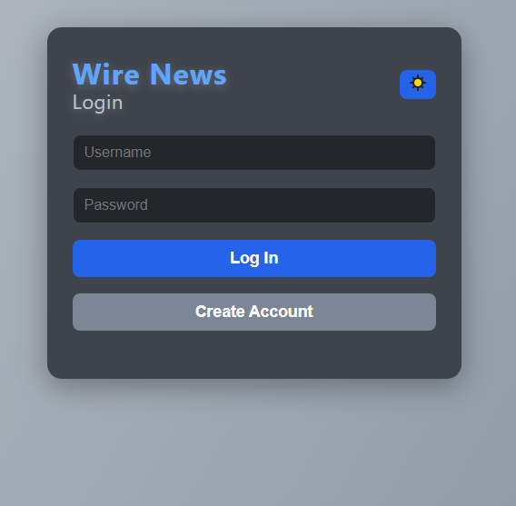
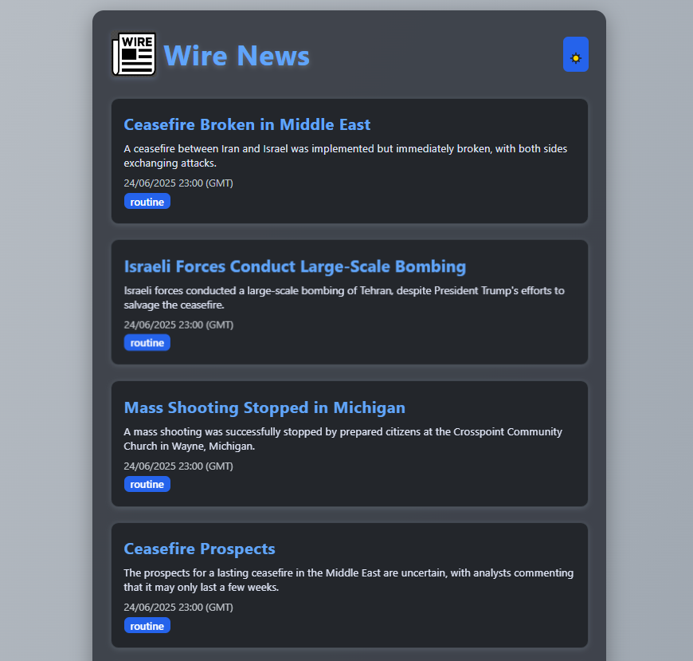
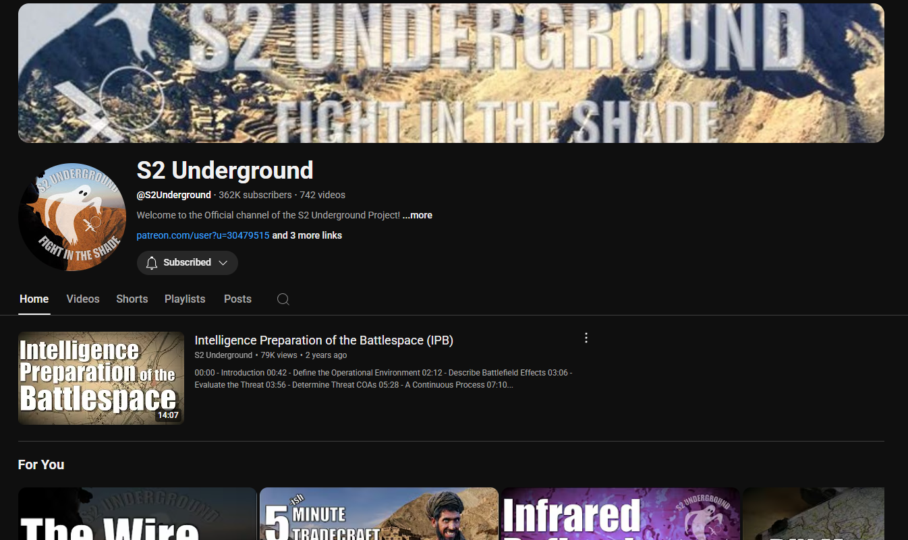

# TheWire-STT

A full-stack news aggregation and summarization platform that fetches, transcribes, and summarizes news stories from The Wire YouTube channel. The project features automated video/audio processing, LLM-powered summarization, and a simple web interface for browsing news stories.

---

## Features

- **Automated Video Fetching:** Downloads the latest news videos from The Wire YouTube channel.
- **Audio Transcription:** Converts audio to text using state-of-the-art speech-to-text models.
- **LLM Summarization:** Uses large language models (Ollama) to extract and summarize news stories from transcripts.
- **API Service:** Stores and serves news stories, user accounts, and sessions via a RESTful API.
- **Modern Web UI:** Browse, search, and read summarized news stories in a responsive web interface.
- **User Authentication:** Register, log in, and manage sessions securely.

---

## Architecture

```
YouTube Channel
     |
     v
[Audio Downloader]
     |
     v
[Transcription (Speech-to-Text)]
     |
     v
[LLM Summarizer]
     |
     v
[API Service & Database]
     |
     v
[Web Frontend]
```

- **Audio Downloader:**
  - Downloads audio from The Wire YouTube channel.
- **Transcription:**
  - Converts audio to text using speech-to-text models.
- **LLM Summarizer:**
  - Processes transcripts with a large language model (Ollama) to extract and structure news stories as JSON.
- **API Service & Database:**
  - Receives structured news JSON, stores it in the database, and provides a REST API for the frontend.
- **Web Frontend:**
  - Fetches news stories from the API and presents them in a modern web interface with authentication.

---

## Screenshots

### Login Page


### Main News Feed


### YouTube Channel Source


---

## Setup & Usage

### Prerequisites
- Python 3.11+
- `ffmpeg` (required for audio processing)
- [Ollama](https://ollama.com/) server (for LLM summarization)

### Installation
1. **Clone the repository:**
   ```sh
   git clone https://github.com/yourusername/TheWire-STT.git
   cd TheWire-STT
   ```
2. **Install dependencies for each service:**
   ```sh
   pip install -r services/api/requirements.txt
   pip install -r services/transcription/requirements.txt
   pip install -r services/web/requirements.txt
   ```
3. **Install ffmpeg:**
   - On Ubuntu: `sudo apt-get install ffmpeg`
   - On Windows: [Download from ffmpeg.org](https://ffmpeg.org/download.html)

4. **Configure environment variables:**
   - Set a secure `SECRET_KEY` for the web and API services.
   - Configure Ollama connection in `services/transcription/ollama_utils/Ollama_Connection.py` if needed.

### Running the Services
- **API Service:**
  ```sh
  cd services/api
  python app.py
  ```
- **Transcription Service:**
  ```sh
  cd services/transcription
  python main.py
  ```
- **Web Frontend:**
  ```sh
  cd services/web
  python app.py
  ```

Then open [http://localhost:8000](http://localhost:8000) in your browser.

---

## Folder Structure

```
TheWire-STT/
├── Images/                # Screenshots and channel images
├── services/
│   ├── api/               # API and database service
│   ├── transcription/     # Video/audio/LLM processing
│   └── web/               # Web frontend
├── requirements.txt       # (Superset of all requirements)
└── README.md
```

---


